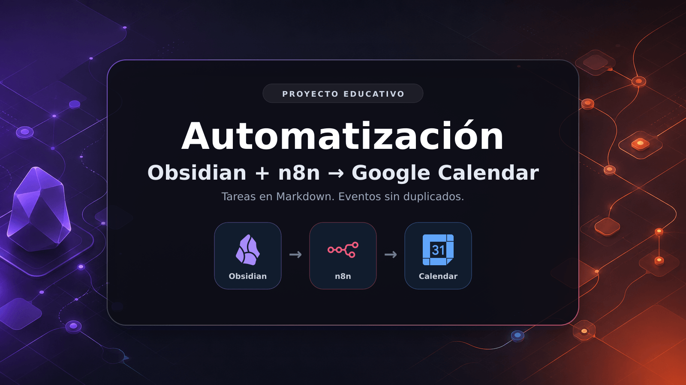

# Automatización Obsidian + n8n → Google Calendar

Aprendé un poco de la famosa automatización en n8n junto conmigo.  
Este proyecto lee tareas desde un archivo de Obsidian, evita duplicados y crea eventos automáticamente en Google Calendar usando n8n.



---

## ¿Qué hace este proyecto?

Este flujo automatiza la creación de eventos en Google Calendar a partir de tareas escritas en Obsidian.

### Flujo

1. **Schedule Trigger** → ejecuta el flujo automáticamente.
2. **Read/Write Files from Disk** → lee un archivo `.md` de Obsidian.
3. **Code (JavaScript)** → procesa y formatea las tareas.
4. **Remove Duplicates** → evita repetir eventos.
5. **Google Calendar** → crea el evento final.

---

## Caso de uso

Ideal si usás Obsidian como organizador personal y querés que ciertas tareas o recordatorios se sincronicen automáticamente con Google Calendar.

---

## Tecnologías usadas

- [Obsidian](https://obsidian.md/)
- [n8n](https://n8n.io/)
- [Google Calendar API](https://developers.google.com/calendar)
- JavaScript

---

## Estructura del proyecto

```text
obsidian-n8n-google-calendar/
├── README.md
├── LICENSE
├── NOTICE.md
├── SECURITY.md
├── .env.example
├── .gitignore
├── images/
│   └── banner.png
├── examples/
│   ├── Lista de tareas.md
│   └── code-node.js
└── docs/
    ├── como-hacerlo.md
    └── problemas-frecuentes.md
```

> El repositorio no incluye un workflow exportado ni credenciales. La idea es construirlo paso a paso en n8n y entender qué hace cada nodo.

## Formato del archivo en Obsidian

Ejemplo de archivo:

```md
- [ ] Estudiar JavaScript 📅 2026-08-01
- [ ] Reunión con cliente 📅 2026-08-02
- [ ] Hacer ejercicio 📅 2026-08-03
```

El flujo toma solamente tareas pendientes (`- [ ]`) que tengan una fecha válida en formato `AAAA-MM-DD`.

## Requisitos

- Tener n8n instalado o corriendo en un entorno que pueda leer el archivo de Obsidian.
- Tener una cuenta de Google Calendar.
- Configurar la credencial de Google Calendar dentro de n8n.
- Tener un archivo `.md` en Obsidian con tareas.

## Cómo hacerlo

Seguí la guía corta de [docs/como-hacerlo.md](docs/como-hacerlo.md).  
Si algo no funciona, revisá [docs/problemas-frecuentes.md](docs/problemas-frecuentes.md).

## Autor

Joaquín Gonzalez.
